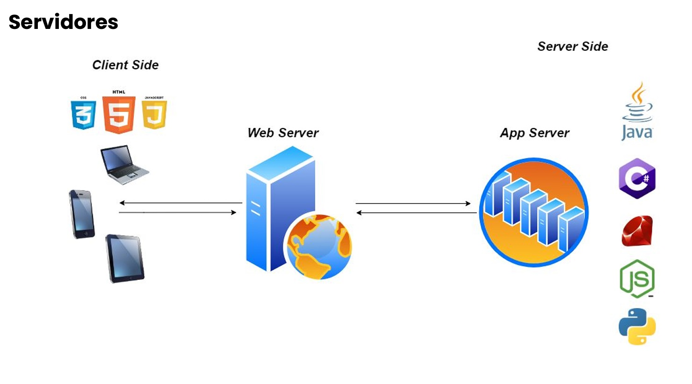

## 📝 Aula 01: Explore as áreas do desenvolvimento
### Introdução
Podemos dividir as áreas do desenvolvimento web em três: 
- Front-end: atua na camada visual, juntamente aos designers, é a partir do front-end que o layout de um site é transformado em código. 

- Back-end: trabalha na camada não visível, onde acontece o processamento de informações e interações com banco de dados. 

- Full Stack: é a junção das duas áreas.

O front-end tem trabalho multidisciplinar, além de estar em constante contato com a área de design, deve também se comunicar com o back-end, sendo responsável por fazer a integração entre as telas e aplicação desenvolvida no back-end. 

A camada de front-end também é conhecida como cliente-side e o back-end de server-side, apesar desses nomes, os servidores também são importantes para o front-end, visto que nosso código HTML, CSS e JavaScript será armazenado neles. 

A grande diferença está no local onde o código será executado, no back-end o código é executado no lado do servidor e o no front-end a execução é feita no lado do cliente, nesse contexto o cliente se refere aos navegadores e o dispositivo onde o navegador foi executado, celulares, tablets, notebooks, TVs etc.

