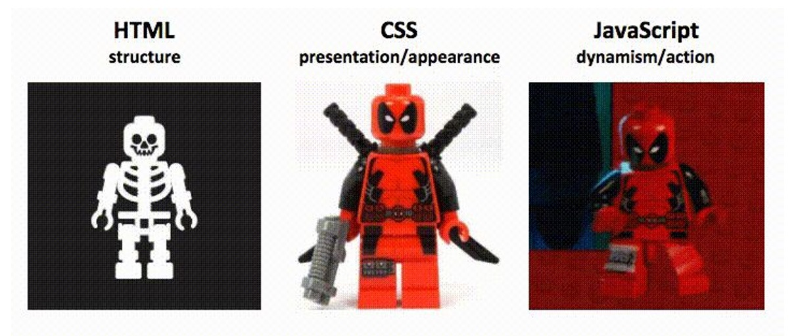
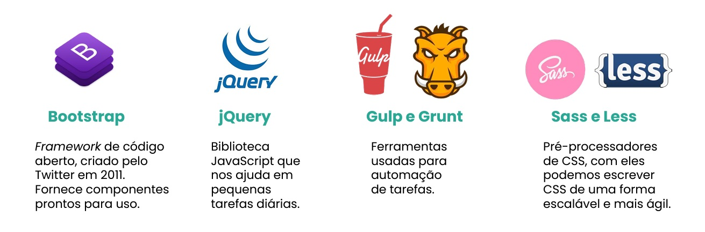
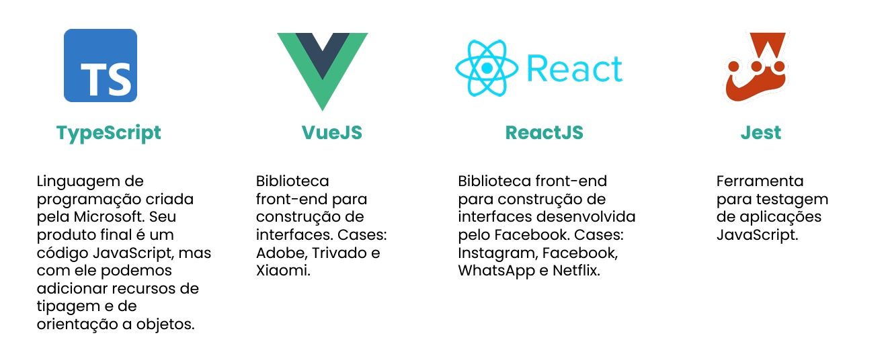

## 📝 Aula 03: Conheça tecnologias de Front-End
### Principais tecnologias
Essas são as principais tecnologias para o desenvolvimento front-end:
- HTML
- CSS
- JavaScript

#### HTML 
Sigla em inglês para Hyper Text Markup Language. Em português significa Linguagem de Marcação de Hipertexto criada por Tim Berners-Lee na década de 90. É utilizada na construção de páginas web, na camada de estrutura. Através dela definimos a semântica e estrutura da página. Em 2014 tivemos o lançamento do HTML5 que trouxe uma revolução para a web.

#### CSS 
Sigla em inglês para Cascading Style Sheet. Em português significa Folhas de Estilo em Cascata. É o mecanismo utilizado na web para aplicação de estilos. Através do CSS definimos a aparência da página, sua apresentação nos diversos tipos de telas. Com o CSS3 conseguimos aplicar animações, transições e efeitos que antes eram possíveis apenas com uso de imagens.

#### Javascript 
Criada por Brendan Eich em 1995, é uma linguagem de programação de alto nível responsável pelas ações e comportamentos da páginas web. Os navegadores interpretam o código JavaScript anexado às páginas HTML.  Seu uso vai além das páginas web, podendo ser usado no back-end, desenvolvimento mobile, IOT (Internet das coisas) e games.

 

### Diferenças

 

### Outras tecnologias

