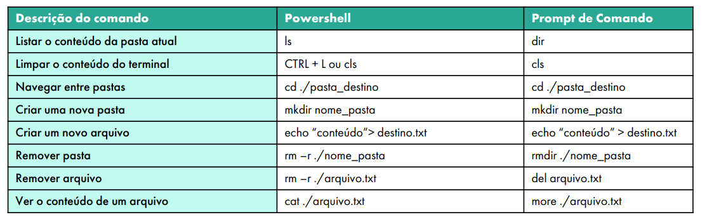

## 📝 Aula 01: Aprendendo a usar o terminal e conhecendo o Git Stage
### ✅ Comandos básicos para usar no terminal


### ✅ Configuração inicial do Git
No terminal, executar os comandos
```
git config--global user.name “Seu nome”
git config--global user.email“Seu e-mail”
```

#### Criando um repositório Git
No terminal, dentro da pasta do projeto, executar o comando
```
git init
```

<br>

### ✅ Adicionando e removendo arquivos
Ao se trabalhar com o Git, não pasta incluir ou deletar um conteúdo na pasta do projeto, é necessário adicionar essa mudança ao stage.

Podemos ver os arquivos que estão sendo considerados pelo Git, que estão no stage, através do comando:
```
git status
```

Para adicionar um arquivo ao stage do Git, dizer ao Git que ele deve considerar o arquivo, execute o comando:
```
git add nome_do_arquivo
```

E para remover o arquivo do stage:
```
git rm—cached nome_do_arquivo
```

Para adicionar todos os arquivos da pasta no stage:
```
git add .
```
