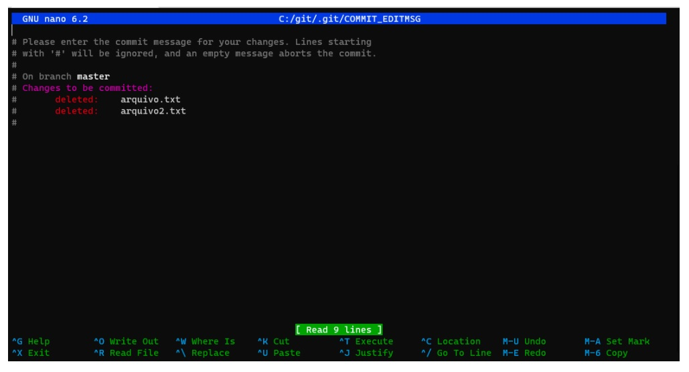

## 📝 Aula 02: Commits
### ✅ Salvando alterações
Para salvar as alterações que foram adicionadas ao stage,  usamos o comando:
```
git commit –irá abrir um editor de textos, dentro do terminal
```



<br>

Nesse editor vamos descrever a alteração que será salva, exemplo: 

remoção de arquivos: arquivo.txt e arquivo2.txt

- Para salvar o texto usamos: Ctrl+ O
- Para sair do editor: Ctrl+ X

Podemos salvar as alteração, criar um commit, sem ter que acessar esse editor, fazemos isso através do comando:
```
git commit–m “minha mensagem”
```

Existe um caminho ainda mais curto, onde podemos adicionar o arquivo ao stage e já salvar a alteração, para isso executamos o comando:
```
git commit–am “minha mensagem”
```

<br>

### ✅ Padrões para nomear commits
Existe um padrão que podemos seguir, ao escrever as mensagens para os commits.

🔧 Chore: usado para pequenas tarefas
```
gitcommit–m “:wrench: chore: removendo arquivo.txt”
```

🐛 Fix: correções
```
gitcommit–m “:bug: fix: correção no cálculo de médias”
```

✨ Feat: inclusão de funcionalidade
```
gitcommit–m “:sparkles: feat: inclusão de função para calcular mediana”
```

📚 Docs: atualização de documentação
```
gitcommit–m “:books: Docs: atualizando o changelog.md”
```

<br> 

### ✅ Changelog
Changelog é um arquivo onde registramos todas as mudanças que  aconteceram em um projeto ao decorrer do tempo.