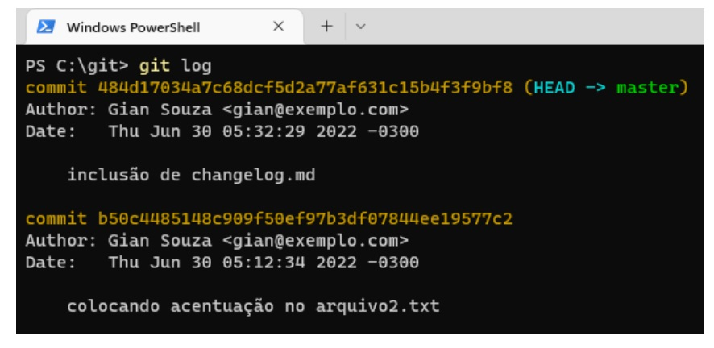
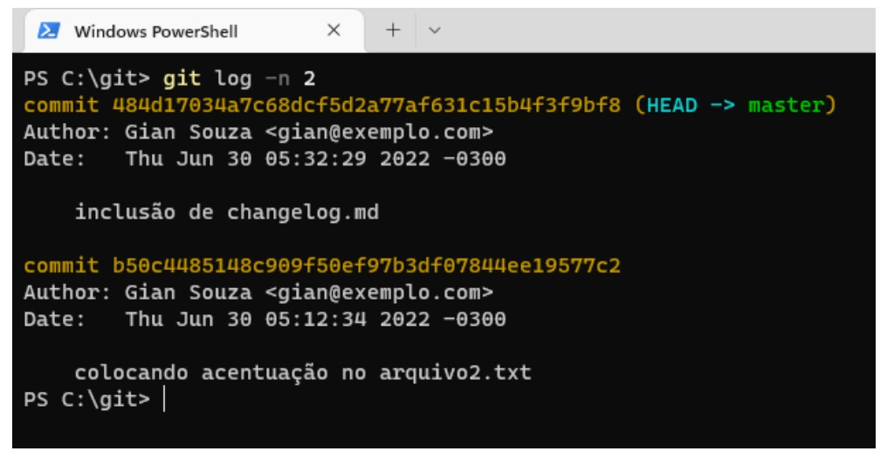
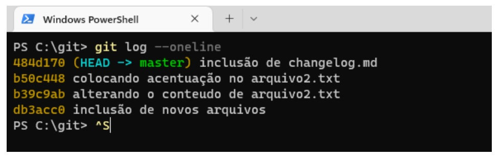
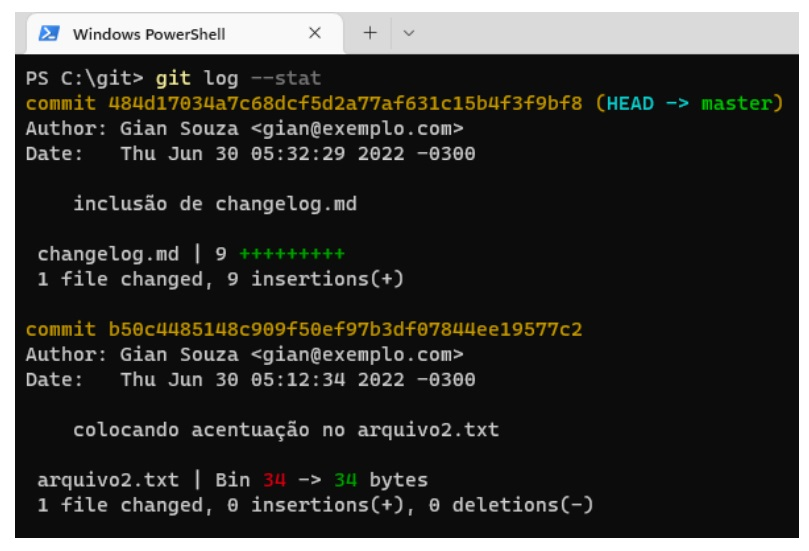
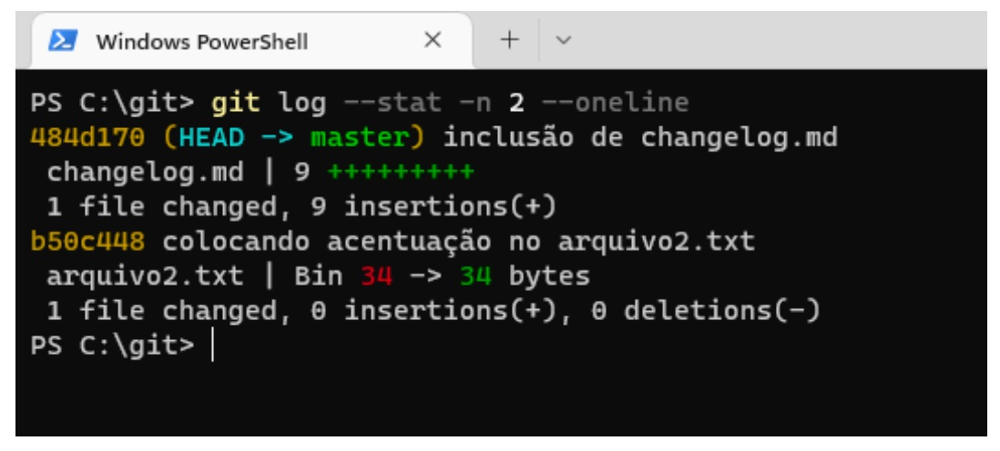

## 📝 Aula 03: Logs
### ✅ Git log
Para visualizar o histórico de commits, usamos o comando:
```
git log
```



<br>

O registro de um commits é composto por:

``Commit``: identificador único do commit

``Author``: autor do commit

``Date``: data em que o commitfoi feito 

Mensagem informado no git commit

<br>

### ✅ Git log - variações
Para visualizar os últimos dois commits:
```
git log –n 2* (ou outro número)
```



<br>

Para visualizar uma versão resumida do registro de commits:
```
git log --oneline
```



<br>

Podemos visualizar o registro de uma forma mais detalhada solicitando o conteúdo da alteração, através do comando:
```
git log --stat
```



<br>

É possível combinar as variações, solicitamos o conteúdo de dois  registros com apenas o identificador do commit:
```
git log --stat–n 2 --oneline
```

