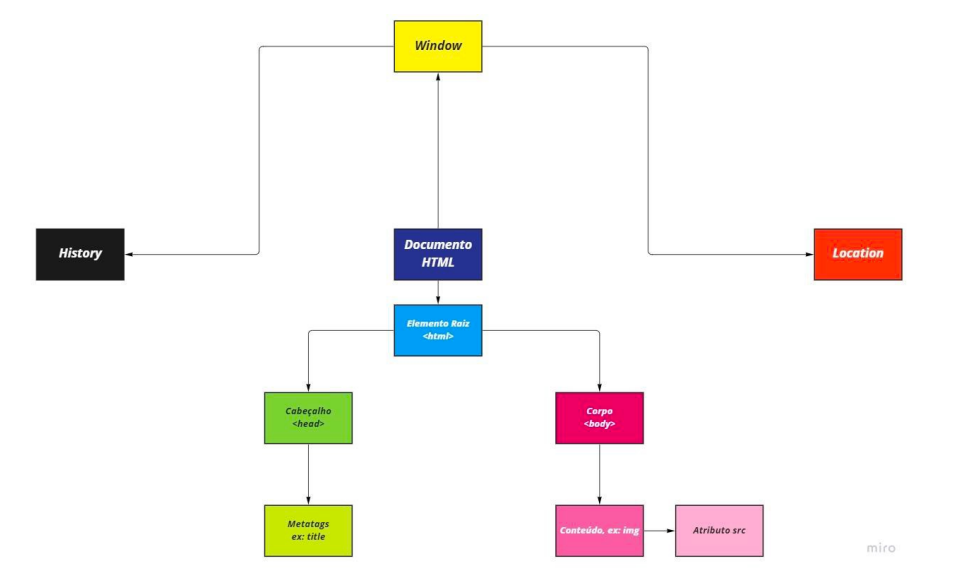

## 📝 Aula 01: HTML DOM
### ✅ HTML DOM - Diagrama

O DOM (Document Object Model) é uma interface pela qual o navegador nos disponibiliza acessar os elementos que compõe um documento. 

Através do DOM podemos, com o uso de JavaScript, manipular os elementos HTML e seus atributos.

O DOM é acessível através do objeto window.document ou apenas document.

Além do DOM o navegador nos disponibiliza dois outros objetos: 

history, onde podemos acessar e manipular o histórico de navegação e o objeto location, que nos possibilita acessar os dados da localização atual, como por exemplo, recuperar o endereço da página.

 

### ✅ Questionário
O que NÃO conseguimos fazer através do DOM?

A- Escrever conteúdo HTML

B- Manipular atributos de elementos

C- Trafegar informações para o back-end

D- Manipular elementos 

Resposta: letra C