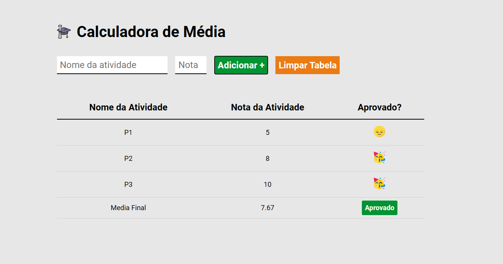

# 🏆 Calculadora de Média de Notas

 

## 📎 Sumario
- 📌 Resumo do Projeto
- ⭐ Features
- 📂 Temas abordados
- ✔️ Tecnologias Utilizadas
- 💻 Demonstração
- 🙋🏻‍♂️ Autor

 

## 📌 Resumo do Projeto
Este Projeto consiste na criação de uma app para calcular a média de notas de alunos, onde o usuário deverá inserir o tipo de atividade (ex: prova de matemática, lista de revisão) e as notas das atividades, onde o app irá informar se o aluno foi aprovado e se as notas estão dentro da média ou abaixo de acordo com o input inicial do usuário ao abrir a página, para determinar a média mínima para calculo.

 

## ⭐ Features
- Opção de inserir a média minima para o calculo;
- Opção de inserir o nome da atividade;
- Opção de inserir a nota da atividade;
- Botão para adicionar mais de uma atividade e nota;
- Botão para limpar as informações da tabela;
- Cálculo da média das notas de forma automática;
- Indicação de aprovação ou reprovação por emojis;
- Layout simples e elegante;
- Bloqueio para inserção de nomes de atividades duplicados;

 

## 📂 Temas abordados
- HTML semântico;
- Estilização CSS com variaveis para cores e tamanho de fonte;
- Utilização de formulário e tabelas;
- Utilização de JavaScript para inserir classes CSS de forma dinâmica;
- Condicional JavaScript para validar média das notas;
- Utilização de eventos do JavaScript como click e submit;
- Utilização de funções JS como splice, includes, toFixed, push e toLowerCase;
- Inserir HTML e valores de forma dinâmica no documento com JavaScript;

 

## ✔️ Tecnologias Utilizadas

 

## 💻 Demonstração
Para visualizar uma prévia do projeto <a href="#" target="_blank"><b>clique aqui</b></a>

 

## 🙋🏻‍♂️ Autor
| [ Bruno Oliveira](https://github.com/BrunoOliveira16) |
| :---: |