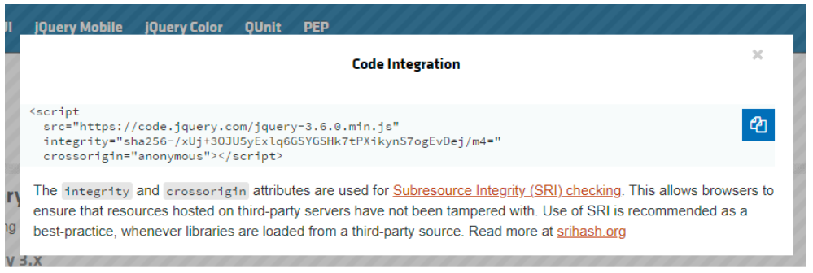
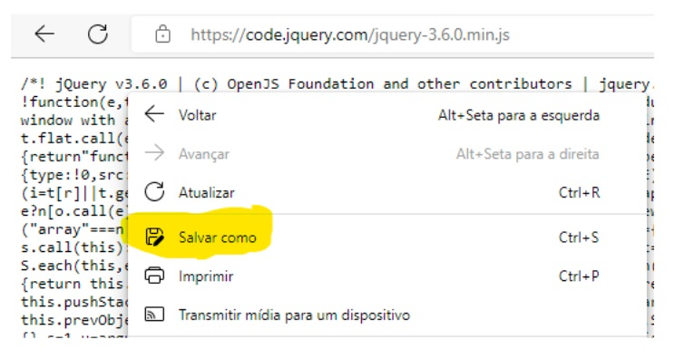

## 📝 Aula 01: Seletores
### ✅ jQuery
Para começarmos a utilizar o jQuery precisamos inclui-lo em nossa página HTML.

Para fazer isso temos dois caminhos: via CDN (Content Delivery Network) e salvando o script na pasta do nosso projeto.

### Via CDN:
Podemos utilizar um servidor de terceiros que já armazenaram o arquivo do jQuery e simplesmente copiar o endereço do arquivo para o atributo src da tag script.

https://releases.jquery.com/



A segunda forma, consiste em baixar o arquivo para a pasta do projeto.

Para fazer isso, podemos simplesmente abrir o link do arquivo no navegador e com o botão direito do mouse clicar em “Salvar como”:



Assim temos maior controle sobre as dependências do nosso projeto e seremos responsáveis por manter este arquivo disponível.

Com o jQuery devidamente incluído em nosso projeto, é necessário seguir uma regra antes de usá-lo.

Todo código que depender do jQuery deverá estar envolvido entre a função:
```
$(document).ready(function() {
// código que depende do jQuery
});
```

Essa função garante que utilizaremos os recursos do jQuery apenas quando todos os recursos da nossa página HTML estiverem baixados.

O jQuery simplifica algumas tarefas básicas que realizamos com o JavaScript, como a seleção de elementos, o gerenciamento de eventos e até mesmo nos ajuda com algumas animações e efeitos básicos.

Para selecionar um elemento com o jQuery escrevemos:

``$(“seletor”)`` – onde o seletor pode ser uma .classe, #ID, nome de uma tag ou consulta mais refinada como: ``$(“input[type=number”)``

<br>

### ✅ Questionário
Qual dos seletores a seguir NÃO é válido?

A- jquery.getElement("#botao-enviar")

B- $("header button")

C- document.querySelector("#botao-enviar")

D- $("#botao-enviar") 

Resposta: Letra A