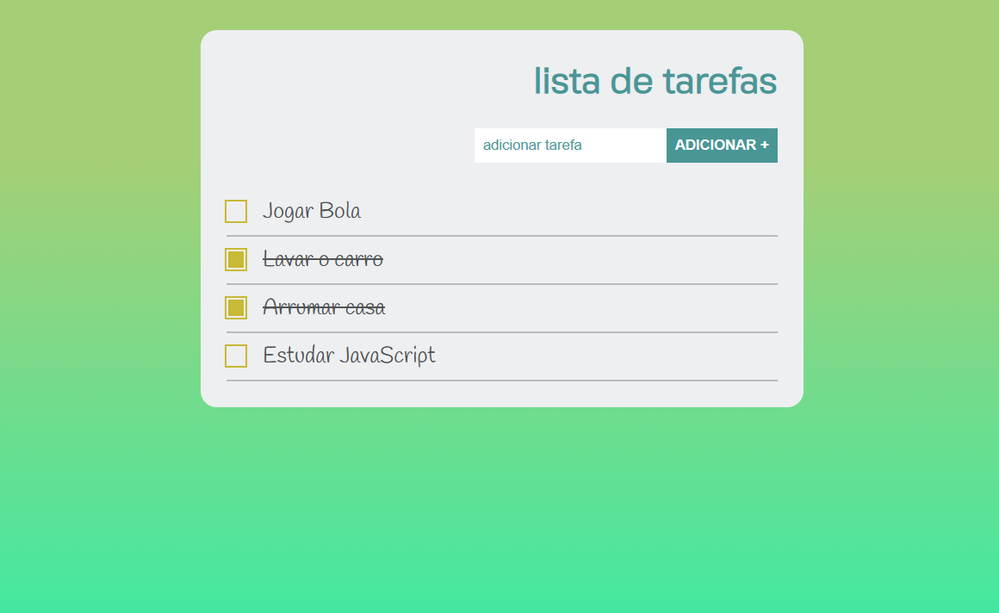

## 💻 A entrega desse exercício consiste em:
- Crie uma aplicação de lista de tarefas. Nesta aplicação deve haver um formulário com um campo para adicionar o nome da tarefa e um botão para cadastrar a tarefa;

- Ao submeter o formulário adicione um elemento <li> dentro de uma lista ordenada ou não;

- Ao clicar nos itens da lista adicione um efeito que aplique uma linha em cima do texto (text-decoration: line-through);

- Utilize o jQuery para manipular os elementos e controlar os eventos;

- Crie uma branch chamada exercício_jquery no repositório do curso e nos envie o link através da plataforma.

 

## 💡 Solução
Para solução do exercicio foi utilizado o método ``toggleClass`` que é um método do jQuery que adiciona ou remove uma ou mais classes de cada elemento no conjunto de elementos correspondentes, dependendo da presença da classe ou do valor do argumento de estado.

Quando apenas um argumento de classe é passado para o método ``toggleClass``, ele funciona como um interruptor, adicionando a classe se ela não estiver presente e removendo-a se estiver presente. 

Referência: https://api.jquery.com/toggleClass/#toggleClass-className

