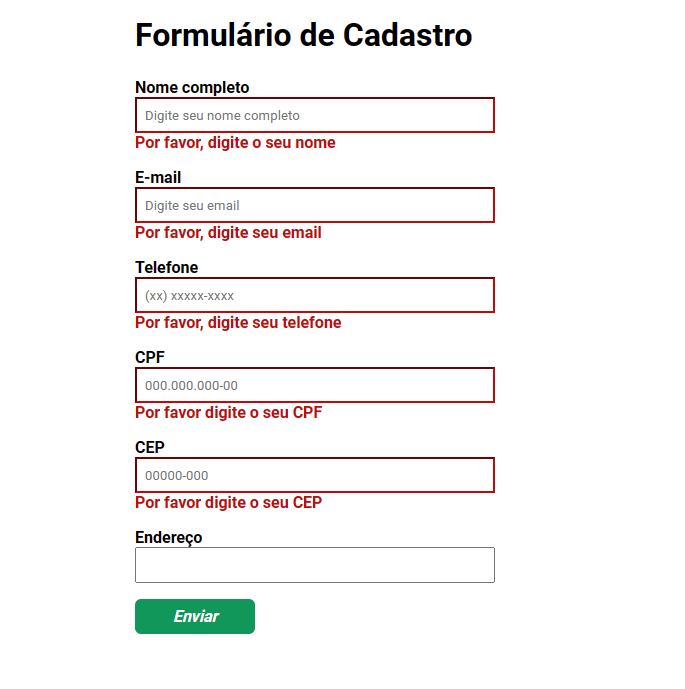

## 💻 A entrega deste exercício consiste em:
- Crie um formulário de cadastro, este formulário deverá conter os campos: nome completo, e-mail, telefone, CPF, endereço completo e CEP;

- Utilize o plugin jQuery Mask Plugin para aplicar máscara aos campos CPF, telefone e CEP;

- Crie uma branch chamada exercicio_plugins_jquery no repositório do curso e nos envie o link através da plataforma.

<br>

## 💡 Solução
Foi implementado as máscaras dos campos através do plugin jQueryMask:
- Link: https://igorescobar.github.io/jQuery-Mask-Plugin/docs.html#using-html-notation-examples

Exemplo do código implementado:
```
//Máscara dos inputs
    $('#phone').mask('(00) 00000-0000', {
        placeholder: '(xx) xxxxx-xxxx',
    });
    $('#cpf').mask('000.000.000-00', {
        reverse: true,
        placeholder: '000.000.000-00',
    });
    $('#cep').mask('00000-000', {
        placeholder: '00000-000',
    });
```

Foi implementado validação nos campos, com mensagens personalizadas com o plugin jQueryValidate
- Link: https://jqueryvalidation.org/

Exemplo do código implementado:jquery
```
//Validação dos campos
    $('form').validate({
        rules: {
            name: {
                required: true
            },
            email: {
                required: true,
                email: true
            },
            phone: {
                required: true
            },
            cpf: {
                required: true
            },
            cep: {
                required: true
            },
            adress: {
                required: false
            }
        },
        messages: {
            name: 'Por favor, digite o seu nome',
            phone: 'Por favor, digite seu telefone',
            email: 'Por favor, digite seu email',
            cpf: 'Por favor digite o seu CPF',
            cep: 'Por favor digite o seu CEP'
        }
    });
```

<br>

### Imagem do formulário:

