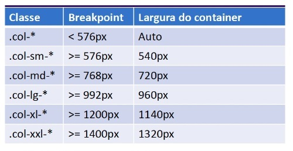

## 📝 Aula 2: Grids
### ✅ Construção de layout
O Bootstrap trabalha com um sistema de grid (grade), onde construímos o layout a partir de linhas e colunas.

Para construir um layout num Boostrap utilizamos as classes container, row e col, seguindo à estrutura:
```
<div class="container">
    <div class="row">
        <div class="col"></div>
        <div class="col"></div>
        <div class="col"></div>
    </div>
</div>
```

Utilizamos a classe container para criar o elemento que irá encapsular o conteúdo da página, o container do Bootstrap já irá centralizar e limitar a largura do conteúdo, com a classe row criamos a linha dentro dela inserimos os elementos com a classe col.

A classe col irá criar colunas uma ao lado da outra, as colunas terão a mesma largura.

O Bootstrap funciona com um sistema de 12 colunas e podemos estar customizando os elementos para ocuparam um determinado número de colunas, fazemos isso com o um sufixo numérico, por exemplo:

A classe col-6 criará um elemento que ocupará 6 colunas, metade de uma linha.

O Bootstrap fornece alguns breakpoint pré-definidos e podemos utiliza-los através da estrutura de classe col-BREAKPOINT-COLUNAS. Por exemplo:

- ``col-md-6`` // md= médio, ocupará 6 colunas
- ``col-sm-12`` // sm= pequeno (small), ocupará a linha toda
- ``col-lg-4`` // lg= large(larga), ocupará um terço da linha.

Relação das classes e breakpoints:



<br>

Exemplo:
```
<div class="container">
        <div class="row">
            <div class="col-sm-12 col-lg-8 g-0"><h2>Destaque</h2></div>
            <div class="col-sm-12 col-lg-4"><h2>Barra Lateral</h2></div>
            <div class="col">Coluna #3</div>
            <div class="col">Coluna #4</div>
            <div class="col">Coluna #5</div>
        </div>
    </div>
```

### ✅ Questionário
O que não fazemos com o Bootstrap?

A- aplicar validação de formulários

B- construir layouts responsivos

C- utilizar componentes estilizados

D- utilizar componentes com comportamento JavaScript 

Resposta: Letra A