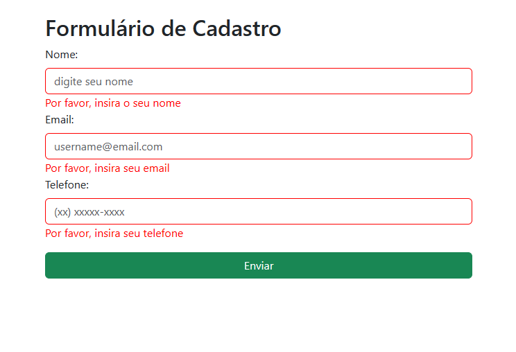

## 💻 A entrega desse exercício consiste em:
- Adicionar o Bootstrap em uma página HTML utilizando a CDN;
- Nesta página HTML crie um formulário de cadastro, este formulário deverá conter os campos: nome, e-mail e telefone, e um botão para o envio;
- Aplique as classes do Bootstrap nos elementos do formulário;
- Crie uma branch chamada exercicio_bootstrap no repositório do curso e envie o link através da plataforma.

 

## 💡 Solução
Foi criado o formulário com base no padrão do bootstrap e adicionado algumas validações com auxilio do jQuery.

