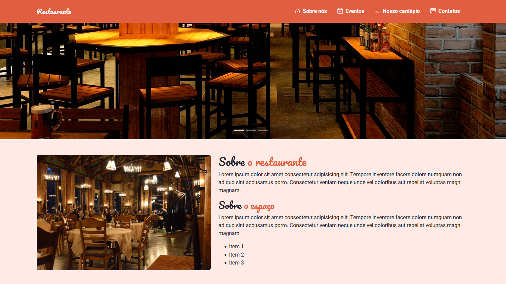

# 🏆 Restaurante Sabor da Casa

## 📎 Sumario

- 📌 Resumo do Projeto
- ⭐ Features
- 📂 Temas abordados
- ✔️ Tecnologias Utilizadas
- 💻 Demonstração
- 🙋🏻‍♂️ Autor

 

## 📌 Resumo do Projeto
O site da cafeteria é um projeto de design web que utiliza o framework bootstrap para criar um layout responsivo e atraente. O site conta com diversas seções que apresentam a cafeteria e seus produtos aos usuários, como um carousel de imagens, cards informativos, uma lista tabulada de produtos, um formulário de contato e um mapa interativo. O site foi desenvolvido com o objetivo de divulgar a cafeteria e atrair mais clientes, oferecendo uma experiência de navegação fácil e agradável.

 

## ⭐ Features
- Menu de navegação responsivo
- Seção de carousel com imagens;
- Seção de cards sobre serviços;
- Seção com produtos em lista tabulada;
- Formulario de contato com validação dos campos;
- Seção com links para midias sociais;

 

## 📂 Temas abordados
- HTML Semântico
- CSS responsivo
- Utilização do Bootstrap
- Validação de campos de formulário com jQuery
- Deploy na Vercel

 

## ✔️ Tecnologias Utilizadas

 

## 💻 Demonstração
Para visualizar uma prévia do projeto <a href="#" target="_blank"><b>clique aqui</b></a>

 

## 🙋🏻‍♂️ Autor
| [ Bruno Oliveira](https://github.com/BrunoOliveira16) |
| :---: |