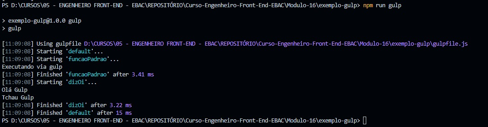

## 📝 Aula 03: Execução de tarefas em série
### Execução de tarefas
As tarefas executadas de forma serial fazem com que o Gulp aguarda uma tarefa terminar para executar a próxima, o que é útil
quando temos um processo que depende de outro.

Por exemplo, reutilizando o exemplo da compressão de imagens, imagine que depois de comprimir as imagens temos a intenção de redimensiona-las.

Nesse caso seria necessário aguardar a compressão dos arquivos para depois redimensiona-las, afinal não teríamos muito ganho em redimensionar as imagens antes de comprimi-las.

Nesta aula criamos uma const chamada ``gulp`` para importar o gulp e modificamos o ``export.default`` para executar as funções criadas em série:
```
const gulp = require('gulp');

// Tarefas Públicas
function funcaoPadrao(callback) {
    console.log("Executando via gulp");
    callback();
}

function dizOi(callback) {
    console.log("Olá Gulp");
    dizTchau();
    callback();
}

// Tarefas Privadas
function dizTchau() {
    console.log("Tchau Gulp")
}

exports.default = gulp.series(funcaoPadrao, dizOi);
exports.dizOi = dizOi;
```
Na primeira linha, o módulo Gulp é importado usando a função require.

As tarefas públicas são exportadas usando a propriedade exports do módulo. A tarefa padrão é definida como uma série de duas tarefas: funcaoPadrao e dizOi.

- Resultado no Terminal:


<br>

### ✅ Questionário
Sobre as tarefas em série é correto afirmar que:

A- Para executar as tarefas em série precisamos executar o comando "npm run gulp serial"

B- Uma tarefa será executada logo após o termino da tarefa anterior

C- As tarefas serão executadas simultaneamente

D- Uma tarefa será executada após o início da tarefa anteriormente informada 

Resposta: letra B