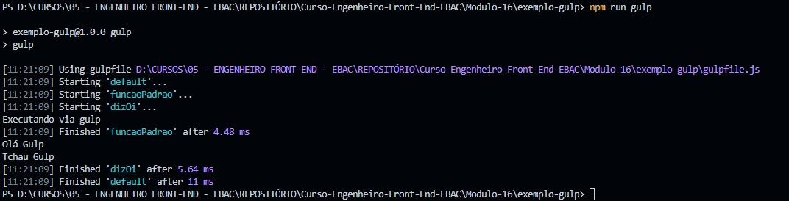

## 📝 Aula 04: Execução de tarefas em paralelo 
### Execução de tarefas
As tarefas executadas de forma paralela serão iniciadas no mesmo instante, porém todo o fluxo de execução irá aguardar o
término de todas as tarefas para concluir.

Esse tipo de execução é interessante quando temos tarefas pesadas e independentes, por exemplo, a compressão de imagens e compilação do SASS.

Comprimir imagens é mais demorada que compilar o SASS, logo essas duas tarefas que não estão relacionadas podem ser executadas de forma paralela.

Nesta aula criamos modificamos o ``export.default`` para executar as funções criadas em paralelo:
```
const gulp = require('gulp');

// Tarefas Públicas
function funcaoPadrao(callback) {
    console.log("Executando via gulp");
    callback();
}

function dizOi(callback) {
    console.log("Olá Gulp");
    dizTchau();
    callback();
}

// Tarefas Privadas
function dizTchau() {
    console.log("Tchau Gulp")
}

exports.default = gulp.parallel(funcaoPadrao, dizOi);
exports.dizOi = dizOi;
```
As tarefas públicas são exportadas usando a propriedade exports do módulo. A tarefa padrão é definida como paralela de duas tarefas: funcaoPadrao e dizOi.

- Resultado no Terminal:


> Note que todas as tarefas iniciaram no mesmo momento, diferente da em série que inicia e finaliza uma tarefa e depois inicia outra.

<br>

### ✅ Questionário
Sobre as tarefas em paralelo é correto afirmar que:

A- O Gulp irá aguardar todo o processamento de uma tarefa antes de iniciar outra

B- Para executar as tarefas em paralelo precisamos executar o comando "npm run gulp parallel"

C- Todas as tarefas serão iniciadas no mesmo momento

D- Para criar tarefas em paralelo no Gulp precisamos instalar o pacote gulp-parallel-tasks 

Resposta: letra C