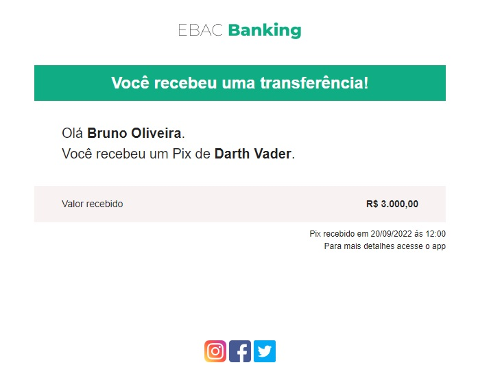

## 📝 Aula 01: Criando o primeiro e-mail
Foi desenvolvido o modelo de e-mail abaixo:

 

## ✅ Questionário
Sobre o uso de imagens na construção de e-mails, é incorreto afirma que:

A- São aceitas apenas no formato GIF

B- São aceitas apenas no formato PNG

C- Nenhuma das opções anteriores

D- São aceitas apenas no formato JPG

Resposta: A resposta correta é “Nenhuma das opções anteriores”. É possível usar imagens em vários formatos, incluindo GIF, PNG e JPG, na construção de e-mails. Portanto, todas as outras opções estão incorretas, pois afirmam que apenas um formato específico é aceito.