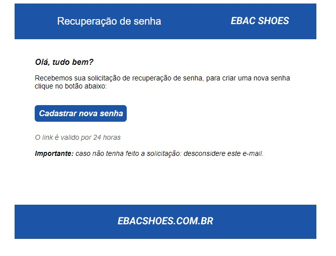

## 📝 Aula 03: Criando um e-mail de recuperação de senha
Foi desenvolvido o modelo de e-mail abaixo:

 

## ✅ Questionário
Qual atributo utilizamos para informar a quantidade de colunas que um elemento TD deve ocupar?

A- colnumber

B- colspan

C- spaces

D- span

Resposta: Para informar a quantidade de colunas que um elemento <td> deve ocupar, usamos o atributo colspan. Portanto, a resposta correta é “B- colspan”. O atributo colspan especifica o número de colunas que uma célula deve abranger. Por exemplo, ``<td colspan="2">`` fará com que a célula ocupe duas colunas. 