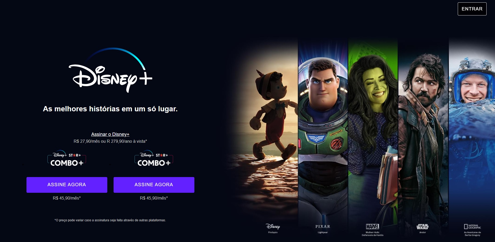
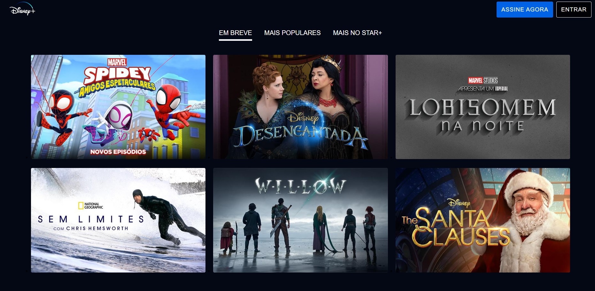

# 🏆 Clone Disney+

 

 

## 🛠️ Como executar o projeto
Para executar este projeto localmente em sua máquina, siga estas etapas:

- Certifique-se de ter o Node.js instalado em sua máquina.

- Clone este repositório em sua máquina local usando o comando ``git clone``.

- Instale as dependências do projeto executando ``npm install`` no diretório do projeto.

- Para executar o projeto em modo de desenvolvimento, execute o comando ``npm run dev``. Isso iniciará o comando ``gulp watch`` que observará as alterações nos arquivos .scss e executará a função styles para compilar os arquivos .scss em .css.

- Para realizar a build do projeto, execute o comando ``npm run build``. Isso iniciará o comando ``gulp`` que executará as funções styles e images em paralelo para compilar os arquivos .scss em .css e otimizar as imagens.

- As funções dentro do arquivo ``gulpfile.js`` podem ser executadas individualmente com o comando ``gulp <nome-da-função>``, por exemplo, para executar apenas a função styles, execute o comando ``gulp styles``.

 

## ✔️ Tecnologias Utilizadas

