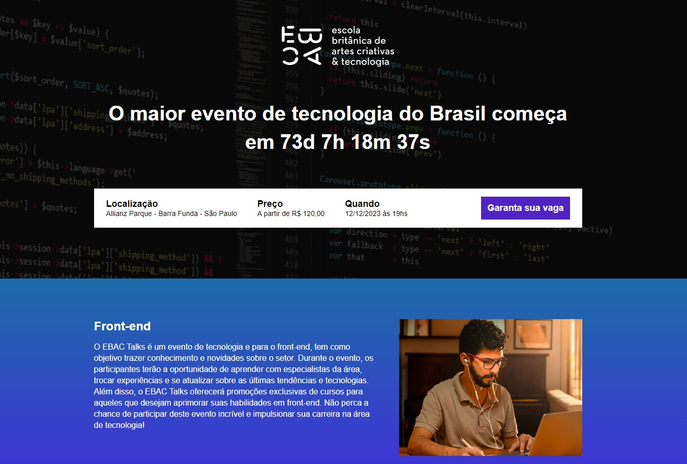
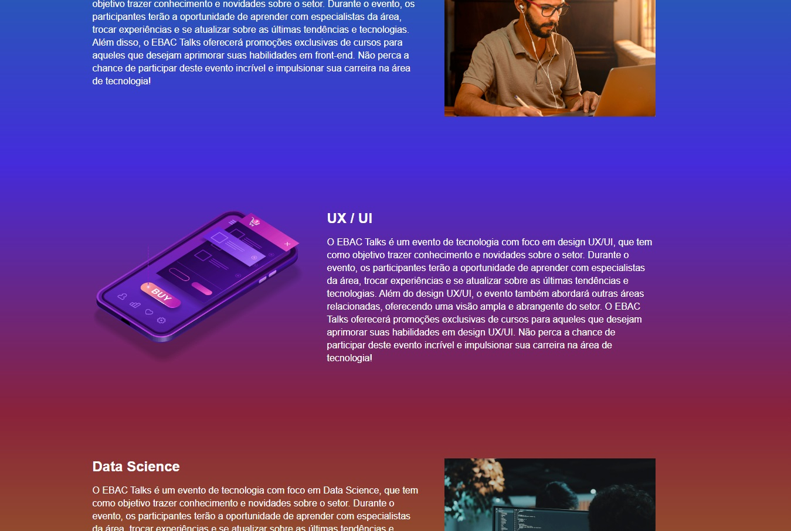

## 🏆 EBAC talks

 

 

## 📎 Sumario 

- 📌 Resumo do Projeto
- 🛠️ Como executar o projeto
- ⭐ Features
- 📂 Temas abordados
- ✔️ Tecnologias Utilizadas
- 🙋🏻‍♂️ Autor
- 💻 Licença

 

## 📌 Resumo do Projeto
Este projeto é uma landing page de um evento ficticio, Que permite o usuário verificar o tempo que falta até a data do evento, trás seções sobre os temas que irão ser abordados durante o evento, a página foi estilizada com sass, utilizado bibliotecas js para animação dos elementos, trabalhado com datas para implementar o contador via javascript e utilizado o parcel para gerenciamento de desenvolvimento e build do projeto.

 

## 🛠️ Como executar o projeto
Para executar este projeto localmente em sua máquina, siga estas etapas:

- Certifique-se de ter o Node.js instalado em sua máquina.

- Clone este repositório em sua máquina local usando o comando ``git clone``.

- Navegue até a pasta do projeto clonado e execute o comando ``npm install`` para instalar todas as dependências necessárias.

- Execute o comando ``npm run dev`` para iniciar o servidor de desenvolvimento local e gerar a build de desenvolvimento.

- O projeto estará rodando na url: http://localhost:1234/

 

## ⭐ Features
- Contador de dias, horas, minutos e segundos que faltam para a data do evento;
- Navegação da página com animações entre as seções, para uma melhor experiência do usuário;
- Layout responsivo e adaptado para diferentes telas;

 

## 📂 Temas abordados
- Desenvolvimento responsivo: O projeto foi construído com o desenvolvimento responsivo em mente, garantindo que a interface do usuário se adapte a diferentes tamanhos de tela e dispositivos. Isso foi alcançado usando técnicas como media queries e unidades relativas para ajustar o layout e o tamanho dos elementos.

- SASS: O projeto usa SASS para estilização, aproveitando recursos como variáveis e mixins para manter o código limpo e modular. Isso permite uma fácil manutenção e atualização dos estilos, bem como a reutilização de código em diferentes partes do projeto.

- AOS: O projeto usa a biblioteca AOS (Animate On Scroll) para adicionar animações suaves aos elementos à medida que eles aparecem na tela durante a rolagem. Isso melhora a experiência do usuário e torna a interface mais dinâmica e interessante.

- Dates em JavaScript: O projeto usa o objeto Date do JavaScript para trabalhar com datas e horários. Isso inclui a manipulação de datas, como adicionar ou subtrair dias, bem como a formatação de datas para exibição na interface do usuário.

- Parcel: O projeto usa o empacotador de aplicativos Parcel para gerenciar o processo de construção e desenvolvimento. Isso inclui a compilação de código SASS e JavaScript, bem como a otimização de imagens e outros recursos. O Parcel também oferece recursos como hot module replacement, que acelera o processo de desenvolvimento ao atualizar automaticamente a página durante as alterações no código.

 

## ✔️ Tecnologias Utilizadas

 

## 🙋🏻‍♂️ Autor

| [ Bruno Oliveira](https://github.com/BrunoOliveira16) |
| :---: |

 

## 💻 Licença
Este projeto está licenciado sob a licença MIT. Isso significa que você pode usar, copiar, modificar e distribuir o código-fonte deste projeto para qualquer finalidade, desde que inclua uma cópia da licença em todas as cópias ou partes substanciais do software.

Para obter mais informações sobre a licença MIT, consulte o <a href="https://opensource.org/license/mit/">texto completo da licença.</a>