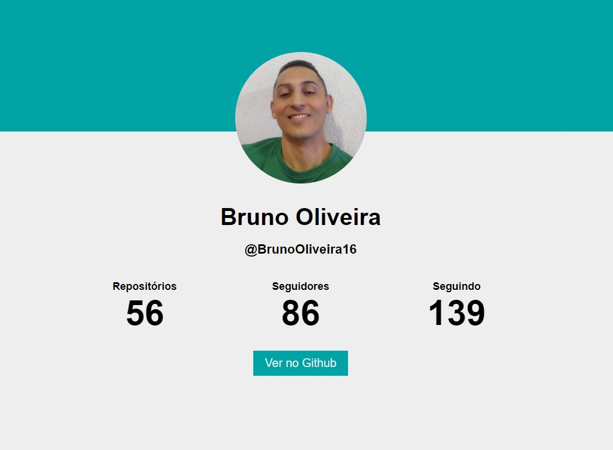

## 📌 EXERCICIO MÓDULO 23 │ Ajax e exceções
### A entrega deste exercício consiste em:
- Adaptar o projeto disponibilizado na plataforma para que os dados sejam preenchidos via requisição Ajax;
- No repositório do projeto crie uma branch chamada exercicio_ajax e armazene o código alterado lá, envie o link do repositório através da plataforma.

<br>

### Solução


<br>

Código desenvolvido
```
document.addEventListener('DOMContentLoaded', function() {
    const url = 'https://api.github.com/users/BrunoOliveira16';
    const avatar = document.querySelector('#avatar');
    const name = document.querySelector('#name');
    const userName = document.querySelector('#userName');
    const publicRepos = document.querySelector('#repos');
    const followers = document.querySelector('#followers');
    const following = document.querySelector('#following');
    const userLink = document.querySelector('#link');

    fetch(url)
        .then(function(response) {
            return response.json();
        })
        .then(function(json) {
            avatar.src = json.avatar_url
            name.innerText = json.name;
            userName.innerText = `@${json.login}`;
            publicRepos.innerText = json.public_repos;
            followers.innerText = json.followers;
            following.innerText = json.following;
            userLink.href = json.html_url;
        })
})
```