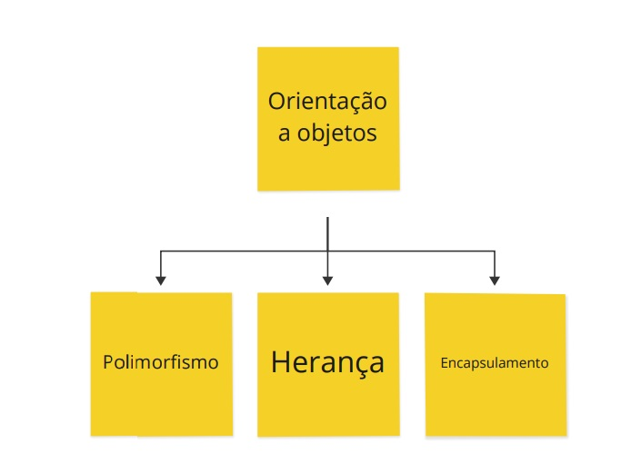

## 📝 Aula 01: Introdução
A Orientação a Objetos é um paradigma de programação que modela um sistema como uma coleção de objetos, onde cada objeto representa algum aspecto particular do sistema. Os objetos contêm tanto funções (ou métodos) quanto dados. Um objeto fornece uma interface pública para outros códigos que desejam usá-lo, mas mantém seu próprio estado interno privado; outras partes do sistema não precisam se preocupar com o que está acontecendo dentro do objeto .

Em JavaScript, a maioria das coisas são objetos, desde os recursos principais do JavaScript, como arrays, até as APIs do navegador construídas em cima do JavaScript. Você pode até criar seus próprios objetos para encapsular funções e variáveis relacionadas em pacotes eficientes e atuar como contêineres de dados úteis .

Os conceitos fundamentais da Orientação a Objetos incluem classes e instâncias, herança e encapsulamento. As classes são como modelos para criar objetos concretos de um determinado tipo. Cada objeto concreto criado é chamado de instância da classe. A herança permite que uma classe herde propriedades e métodos de outra classe. O encapsulamento é o ato de agrupar dados e funções relacionados em um objeto e controlar o acesso a esses dados e funções.

### Abstração
A programação orientada a objetos é composta pelos pilares: 
- herança
- polimorfismo
- encapsulamento

Através da ``programação orientada a objetos (POO)`` podemos representar os itens do mundo real na programação.

Pense em um carro, ele é composto por rodas, pneus, volante, portas e outros itens. Essa ideia que temos de um carro é uma abstração. Um carro é composto por muito mais itens, temos a parte elétrica, mecânica, em carros mais modernos temos a programação presente.

Embora um carro seja composto por diversas partes não é necessário conhecer os seus detalhes para dirigir um,

 

## ✅ Questionário
Qual dos pilares da programação orientada a objetos permite criar classes que estendem atributos e métodos de outras classes?

A- encapsulamento;

B- herança;

C- polimorfismo;

D- Todas as opções;

Resposta: Letra B. O pilar da programação orientada a objetos que permite criar classes que estendem atributos e métodos de outras classes é a herança.