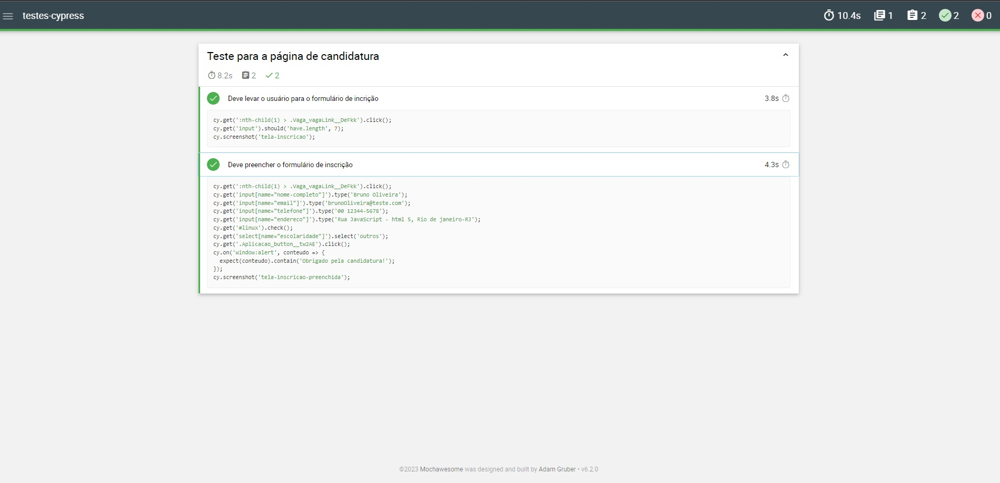

## 📝 Aula 04: Explore recursos extras do Cypress
O Cypress é uma ferramenta de teste de ponta a ponta que permite escrever testes para suas aplicações web. Ele fornece uma API para interagir com elementos da sua página, permitindo que você simule ações do usuário, como clicar em um botão, digitar em um campo de entrada, etc.

Para executar os testes do Cypress, você pode usar o seguinte comando:
```
npm run cypress run
```

O Cypress também fornece a função ``screenshot()``, que permite tirar uma captura de tela do estado atual do navegador durante um teste. Aqui está um exemplo de como você pode usar essa função:

```
it('Deve levar o usuário para o formulário de incrição', () => {
    cy.get(':nth-child(1) > .Vaga_vagaLink__DeFkk').click()
    cy.get('input').should('have.length', 7)  

    cy.screenshot('tela-inscricao')
})
```
Neste exemplo, o teste visita uma página, clica em um link e verifica se existem 7 campos de entrada na página. Em seguida, ele tira uma captura de tela e salva com o nome ``'tela-inscricao'``.

<br>

### Gerando relatórios HTML com Mocha Awesome
O Mocha Awesome é um relatório de testes do Mocha que gera relatórios HTML bonitos. Para instalá-lo, você pode usar o seguinte comando:
```
npm install --save-dev mochawesome
```

Em seguida, você precisará configurar o Cypress para usar o Mocha Awesome como seu relatório. Você pode fazer isso adicionando as seguintes configurações ao seu arquivo ``cypress.config.js``:

```
const { defineConfig } = require("cypress");

module.exports = defineConfig({
  e2e: {
    setupNodeEvents(on, config) {
      // implement node event listeners here
    },
  },
  reporter: 'mochawesome',
  reporterOptions: {
    reportDir: 'cypress/relatorio',
    overwrite: true,
    html: true,
    json: false,
    timestamp: 'ddmmyyyy_HHMMss'
  }
});
```

Para gerar os relatórios, você pode usar o seguinte comando:

```
npm run cypress run --reporter mochawesome
```
Isso irá executar seus testes e gerar um relatório HTML no diretório especificado.

Resultado:
